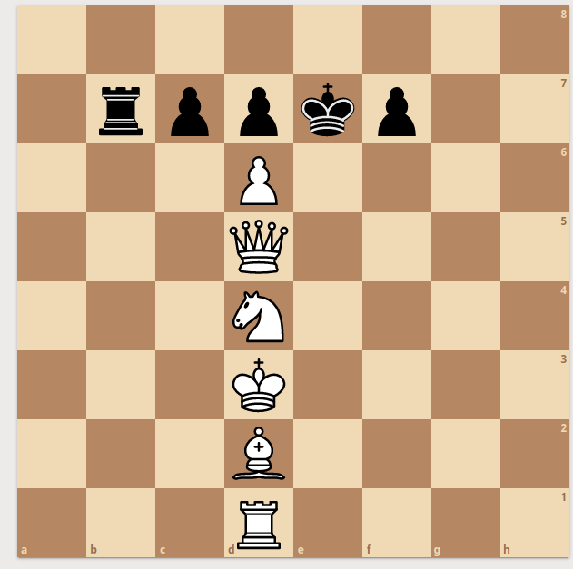
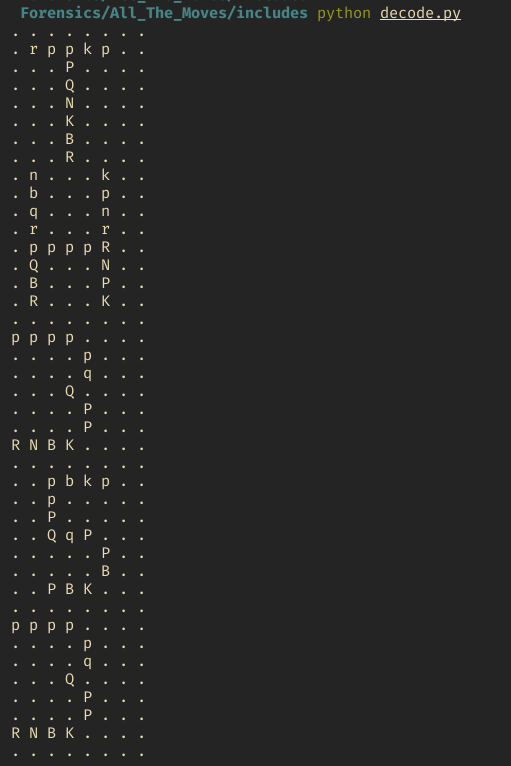

# Writeup

We are provided with a file with what looks to be just a bunch of random strings in lines. They are not encoded in any commonly used encoding types. We now turn our attention to the question. It makes a reference to some mysterious MVL person. On searching for that name, we are led to the chess GM, Maxime Vachier Lagrave.

So, now we know that the encoding is related to chess. On searching for the various chessboard notation, we find the FEN notation, which is the encoding used for the data here. Now, with that knowledge in mind, we can then plug this into a chess site like [lichess](https://lichess.org/editor), and by doing that, we can see that each of these lines represents characters represented by the pieces on the board.

Here is an example for the first one

This can also be done with a python script like [this](includes/decode.py), which reads the lines, and provides you with images of every string, which can then be read.

Hence, each of these is decoded, and then the final flag is found.
