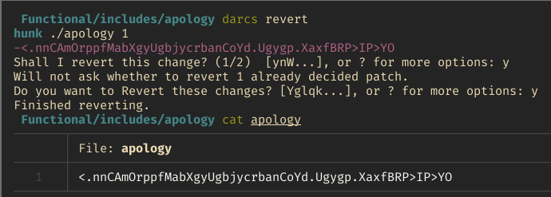

# Writeup

We are provided with a zip file which on extracting provides a directory, and on going into the directory we are presented with another one. On going into that as well, as the question states, we are presented with what seems like a bunch of random files. But, files like index will be familiar to anyone who has poked around in their .git folders.

  But the thing is, this is not git. But the question does make references to a certain version controlling system, a **functional** one. This here refers to the program **darcs**, a version control system written in **haskell** hence, the multiple functional references. This can also be ascertained from reading through some of the files provided in the directory itself. But, in its current state, the directory is not a valid darcs repo. To change that, we just need to change the name of the inner directory to **_darcs**.

  Now, that that is settled, we can run the various darcs commands to see what the repo holds. On running **darcs status** , we see that a file called apology was commited but has been removed. 

  

  To restore the file, we can use the **darcs revert** command.

  

  The file that is returned is just a simple text file, but the data in makes no sense. On reading the question further, it makes reference to RSI, i.e, Repetitive Strain Injury, and a alternative layout to fix it. This is alluding to the prevelance of the **qwerty** standard and its drawbacks, and highlights the **dvorak** standard, which is designed to have lower movement of the fingers. 

  Now, that we have this context, we can deduce that the file is just data typed in a dvorak keyboard, with the qwerty letters in mind. So, we can decode with a dvorak to qwerty translator like the one [here](http://wbic16.xedoloh.com/dvorak.html)
