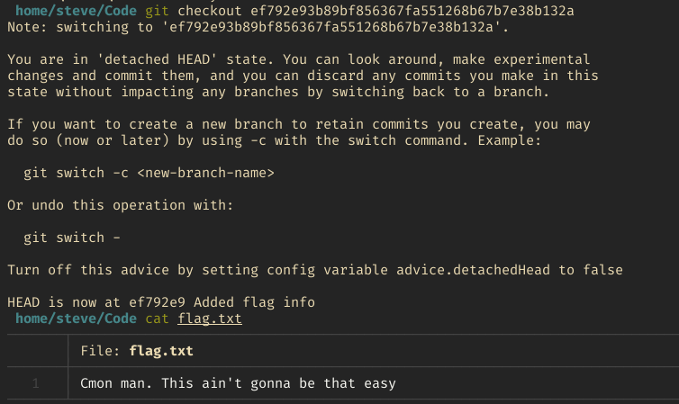

# Writeup

We are provided a zip file for the challenge. On unzipping it, we find that there are multiple diirectories, with a format similar to a linux home diirectory.

On going through the folders, it becomes quickly apparent that the **adam** directory contains no information whatsover. We can now switch our focus to the **steve** directory. This contains four sub-diirectories : **Code, Desktop, Downloads and secrets**.

The Desktop and Downloads directories contain nothing of value, but the other two seem more interesting. The secrets directory contains a hidden file named **tuts**, which talks about git, which we keep in mind for now.

Next, we turn our attention to the Code directory. It seems to be a git directory, and on looking through the git commit history, we find a mention of flag info that was added, then quickly removed. 

We can find out what the file contained, by first checking out the particular commit, and then, reading the file, but we are treated with a troll message that does not lead anywhere. 

There doesn't seem to be any other secrets hidden in a different branch or anything. But, if you paid attention to the tuts file and the problem title, they both reference this concept of an **Unaccounted file** that is still present in the git objects directory. So, our next plan is to find all the object hashes that do not belong to any of the git history. This can be accomplished with a script like [this](SolnStuff/solve.py). It also writes the data of the unaccounted hash objects to files. 

We have 32 files that are recovered in this manner. On looking through them, we see that one of them has the word clue written on it, with some gibberish following it. But it is not gibberish. If the question statement is reexamined, it alludes to a second **biggest base**, which in this context refers to the **base 65536 encoding**. There are multiple ways to decode this, but it can be done fairly easily with the **base65536** library for python as done [here](SolnStuff/decode.py)

The clue talks about this particular base being created for some specific purpose. If we go through the [repo](https://github.com/qntm/base65536/) associated with it, we can see that it was created to facilitate the spread of the replay info of the game **HATETRIS** on twitter. The clue also talks about this encoding being inefficient for this particular use, and hence, a new format was created. The repo also talks about this, the **base2048** format, which is what the other files are encoded in.

Now, if we go on to the [hatetris](http://qntm.org/files/hatetris/hatetris.html), and plug in the file data as a replay, and add the number 97 to it, we are presented with a bunch of ASCII codes, which when put next to each other produce the necessary flag. Though the entire process is tedious, it can be slightly quickened with the help of a script like [this](SolnStuff/reduce.py), where you only enter the unique data into the website.
